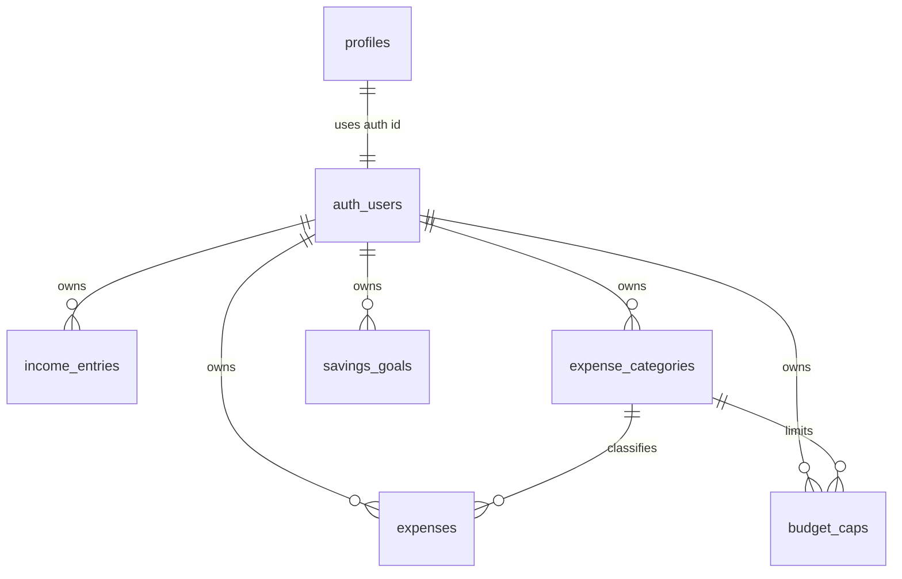

# Pocket-Mate Database Schema Plan

## Goal

The database should support a manual-first finance app that answers:

- how much money came in
- how much was spent
- how much is protected for savings
- how much can be safely spent today
- whether a user is close to or over a category cap

## Database Choice

Pocket-Mate will start with Supabase Postgres.

Reasons:

- relational finance data fits Postgres well
- Supabase Auth integrates with user-owned rows
- Row Level Security can protect each user's data
- SQL views can support dashboard summaries later
- the app can still move to another Postgres host later if needed

## Money Storage Rule

Store money as integer cents, not floating-point decimals.

Example:

```text
$12.99 -> 1299
```

This prevents rounding bugs in totals, caps, and savings calculations.

## Core Tables

### profiles

Stores app-specific user settings.

```text
id uuid primary key references auth.users(id)
display_name text
currency_code text not null default 'CAD'
pay_cycle text not null default 'monthly'
pay_cycle_start_day integer
created_at timestamptz not null default now()
updated_at timestamptz not null default now()
```

Allowed `pay_cycle` values:

```text
weekly
bi_weekly
semi_monthly
monthly
custom
```

### income_entries

Stores paystubs and other income.

```text
id uuid primary key
user_id uuid not null references auth.users(id)
amount_cents integer not null
source text
received_on date not null
note text
created_at timestamptz not null default now()
updated_at timestamptz not null default now()
```

### expense_categories

Stores user-defined spending categories.

```text
id uuid primary key
user_id uuid not null references auth.users(id)
name text not null
color text
icon text
is_default boolean not null default false
created_at timestamptz not null default now()
updated_at timestamptz not null default now()
```

Examples:

```text
Food
Transport
Rent
Bills
Shopping
Entertainment
Health
Savings
Other
```

### expenses

Stores daily spending.

```text
id uuid primary key
user_id uuid not null references auth.users(id)
category_id uuid references expense_categories(id)
amount_cents integer not null
spent_on date not null
merchant text
note text
created_at timestamptz not null default now()
updated_at timestamptz not null default now()
```

### budget_caps

Stores category spending limits for a cycle.

```text
id uuid primary key
user_id uuid not null references auth.users(id)
category_id uuid not null references expense_categories(id)
amount_cents integer not null
period text not null default 'monthly'
starts_on date
ends_on date
created_at timestamptz not null default now()
updated_at timestamptz not null default now()
```

Allowed `period` values:

```text
weekly
bi_weekly
semi_monthly
monthly
custom
```

### savings_goals

Stores protected savings goals.

```text
id uuid primary key
user_id uuid not null references auth.users(id)
name text not null
target_amount_cents integer not null
current_amount_cents integer not null default 0
target_date date
is_active boolean not null default true
created_at timestamptz not null default now()
updated_at timestamptz not null default now()
```

## Later Tables

These should wait until core finance is stable:

```text
planned_purchases
recurring_transactions
no_spend_days
monthly_snapshots
notification_preferences
audit_events
```

## Relationships



`auth_users` represents Supabase `auth.users`.

## Dashboard Calculations

Initial dashboard calculations can happen in app utilities. Later they can move into SQL views or database functions.

Required calculations:

- total income in current cycle
- total expenses in current cycle
- total protected savings
- remaining balance
- category spent amount
- category cap remaining
- safe-to-spend today
- budget pressure score

## Safe-To-Spend Formula

Initial version:

```text
cycle_income
- cycle_expenses
- protected_savings_remaining
= remaining_spendable

remaining_spendable / days_until_next_payday
= safe_to_spend_today
```

The calculation should never show a negative safe-to-spend amount as normal spending capacity. If the result is below zero, the UI should show a warning state.

## Indexes

Recommended indexes:

```text
profiles(id)
income_entries(user_id, received_on)
expense_categories(user_id)
expenses(user_id, spent_on)
expenses(user_id, category_id, spent_on)
budget_caps(user_id, category_id)
savings_goals(user_id, is_active)
```

## Row Level Security Plan

Enable RLS on every app table.

Policy rule:

```text
user can only select, insert, update, and delete rows where user_id = auth.uid()
```

For `profiles`, the rule is:

```text
id = auth.uid()
```

## Insert Rules

The app should not trust a client-provided `user_id` blindly.

For inserts:

- require authenticated user
- set `user_id` from the current auth session
- validate ownership through RLS

## Data Deletion

User-owned records can be deleted by the owner.

Later, account deletion should remove or anonymize all user-owned data.

## Migration Order

Create tables in this order:

1. profiles
2. income_entries
3. expense_categories
4. expenses
5. budget_caps
6. savings_goals

Then add:

1. indexes
2. updated_at trigger
3. RLS policies
4. seed/default category strategy

The first schema migration is maintained at:

```text
supabase/migrations/202607110001_create_finance_core.sql
```

## Open Decisions

- whether default categories are copied per user or stored globally
- whether savings should be a category, a goal, or both
- whether pay cycles should be stored as profile settings or as separate pay periods
- whether deleted categories should be blocked if expenses exist
