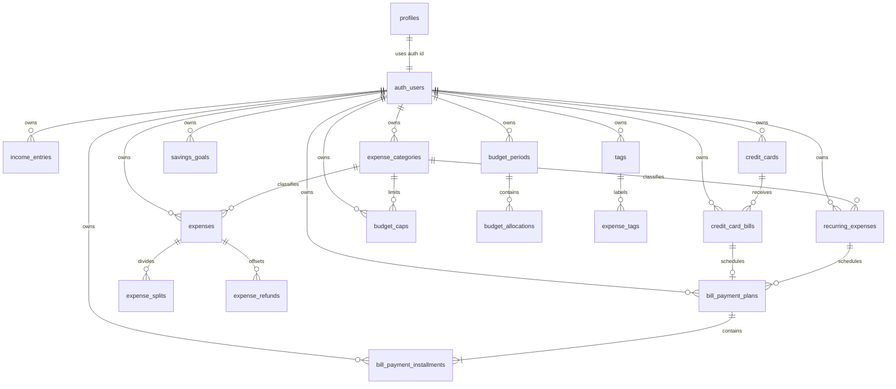

# Pocket-Mate Database Schema Plan

## Goal

The database should support a manual-first finance app that answers:

- how much money came in
- how much was spent
- how much is protected for savings
- how much can be safely spent today
- whether a user is close to or over a category cap

## Database Choice

Pocket-Mate will start with Supabase Postgres.

Reasons:

- relational finance data fits Postgres well
- Supabase Auth integrates with user-owned rows
- Row Level Security can protect each user's data
- SQL views can support dashboard summaries later
- the app can still move to another Postgres host later if needed

## Money Storage Rule

Store money as integer cents, not floating-point decimals.

Example:

```text
$12.99 -> 1299
```

This prevents rounding bugs in totals, caps, and savings calculations.

## Core Tables

### profiles

Stores app-specific user settings.

```text
id uuid primary key references auth.users(id)
display_name text
currency_code text not null default 'CAD'
pay_cycle text not null default 'monthly'
pay_cycle_start_day integer
pay_cycle_anchor_date date
created_at timestamptz not null default now()
updated_at timestamptz not null default now()
```

Allowed `pay_cycle` values:

```text
weekly
bi_weekly
semi_monthly
monthly
custom
```

### income_entries

Stores paystubs and other income.

```text
id uuid primary key
user_id uuid not null references auth.users(id)
amount_cents integer not null
source text
received_on date not null
note text
created_at timestamptz not null default now()
updated_at timestamptz not null default now()
```

### expense_categories

Stores user-defined spending categories.

```text
id uuid primary key
user_id uuid not null references auth.users(id)
name text not null
color text
icon text
is_default boolean not null default false
created_at timestamptz not null default now()
updated_at timestamptz not null default now()
```

Examples:

```text
Food
Transport
Rent
Bills
Shopping
Entertainment
Health
Savings
Other
```

### expenses

Stores daily spending.

```text
id uuid primary key
user_id uuid not null references auth.users(id)
category_id uuid references expense_categories(id)
amount_cents integer not null
spent_on date not null
merchant text
note text
created_at timestamptz not null default now()
updated_at timestamptz not null default now()
```

### recurring_expenses

Stores known repeating commitments such as rent, internet, and subscriptions.
Categories still describe the purpose of each commitment.

```text
id uuid primary key
user_id uuid not null references auth.users(id)
category_id uuid not null references expense_categories(id)
name text not null
amount_cents integer not null
cadence text not null default 'monthly'
charge_day integer not null
starts_on date not null
ends_on date
is_active boolean not null default true
source_expense_id uuid references expenses(id)
note text
created_at timestamptz not null default now()
updated_at timestamptz not null default now()
```

### credit_cards

Stores reusable, non-sensitive card labels. Full card numbers are never stored.

```text
id uuid primary key
user_id uuid not null references auth.users(id)
nickname text not null
issuer text
last_four text
is_active boolean not null default true
financial_account_id uuid not null references financial_accounts(id)
tracking_mode text not null default 'statement'
created_at timestamptz not null default now()
updated_at timestamptz not null default now()
```

`tracking_mode` is either `statement` or `transactions`. Statement mode counts
aggregate statement payments as spending. Transaction mode counts individual
purchases as spending and treats card payments as transfers so they are not
counted twice.

### financial_accounts

Stores user-managed assets and liabilities. A positive balance means money
available for asset accounts and money owed for liability accounts.

```text
id uuid primary key
user_id uuid not null references auth.users(id)
name text not null
account_type text not null
opening_balance_cents integer not null default 0
currency_code text not null default 'CAD'
institution_name text
last_four text
is_active boolean not null default true
created_at timestamptz not null default now()
updated_at timestamptz not null default now()
```

Supported types are checking, savings, cash, credit card, loan, investment, and
other. Credit-card accounts are created automatically from saved card metadata;
full account or card numbers are never stored.

### account_transfers

Moves money between two owned accounts without changing income, spending, or a
category budget. Optional source links reconcile statements and installments.

```text
id uuid primary key
user_id uuid not null references auth.users(id)
from_account_id uuid not null references financial_accounts(id)
to_account_id uuid not null references financial_accounts(id)
amount_cents integer not null
transferred_on date not null
note text
credit_card_bill_id uuid
bill_payment_installment_id uuid
created_at timestamptz not null default now()
updated_at timestamptz not null default now()
```

### credit_card_bills

Stores aggregate statements for users who do not record every card purchase.

```text
id uuid primary key
user_id uuid not null references auth.users(id)
credit_card_id uuid not null references credit_cards(id)
amount_cents integer not null
statement_on date not null
due_on date not null
paid_on date
note text
created_at timestamptz not null default now()
updated_at timestamptz not null default now()
```

### bill_payment_plans

Stores the current user-managed payoff plan for a card statement or one monthly
instance of a recurring bill.

```text
id uuid primary key
user_id uuid not null references auth.users(id)
credit_card_bill_id uuid references credit_card_bills(id)
recurring_expense_id uuid references recurring_expenses(id)
period_start date not null
title text not null
total_amount_cents integer not null
due_on date not null
status text not null default 'active'
created_at timestamptz not null default now()
updated_at timestamptz not null default now()
```

Exactly one bill source is required. Card-plan total changes also update the
linked statement balance atomically.

### bill_payment_installments

```text
id uuid primary key
user_id uuid not null references auth.users(id)
payment_plan_id uuid not null references bill_payment_plans(id)
amount_cents integer not null
planned_on date not null
paid_on date
created_at timestamptz not null default now()
updated_at timestamptz not null default now()
```

Paid installments are retained when a plan is edited. Only unpaid installments
are replaced. The database validates ownership, a 2-to-8 payment limit, exact
cent totals, and a maximum 12-month planning horizon.

### budget_caps

Stores category spending limits for a cycle.

```text
id uuid primary key
user_id uuid not null references auth.users(id)
category_id uuid not null references expense_categories(id)
amount_cents integer not null
period text not null default 'monthly'
starts_on date
ends_on date
created_at timestamptz not null default now()
updated_at timestamptz not null default now()
```

Allowed `period` values:

```text
weekly
bi_weekly
semi_monthly
monthly
custom
```

`budget_caps` remains the legacy category-limit source for existing clients.
New monthly planning uses the period tables below.

### budget_templates, budget_periods, and budget_allocations

Templates hold defaults for future months. A period represents one calendar
month, and its allocations snapshot each category's planned amount and rollover
mode. Supported rollover modes are `none`, `positive_only`, and `full`.

The app calculates the complete allocation chain in month order. Changing an
earlier month therefore recomputes every later month's carried surplus or
overspend instead of trusting a stale cached total.

### expense_splits and expense_refunds

An expense can be split across two to eight unique categories. Split amounts
must reconcile exactly to the parent expense. Refunds are separate positive
records tied to the original expense and an optional destination account;
cumulative refunds cannot exceed the original amount.

Both tables are read-only to normal table writes. Protected Postgres functions
lock the parent expense, validate ownership and cents, and then write the rows.
When a split expense is refunded, category reporting allocates every refund
cent proportionally across its split categories.

### tags, expense_tags, categorization_rules, and review_items

Tags add user-defined context without changing accounting categories.
Categorization rules match normalized merchant or note text using allowlisted
operators and deterministic priority ordering. Rules can apply immediately or
place the new expense in the review queue for explicit approval.

### savings_goals

Stores protected savings goals.

```text
id uuid primary key
user_id uuid not null references auth.users(id)
name text not null
target_amount_cents integer not null
current_amount_cents integer not null default 0
monthly_contribution_cents integer not null default 0
target_date date
is_active boolean not null default true
created_at timestamptz not null default now()
updated_at timestamptz not null default now()
```

## Later Tables

These should wait until core finance is stable:

```text
planned_purchases
no_spend_days
monthly_snapshots
notification_preferences
audit_events
```

## Relationships


```mermaid
erDiagram
    profiles ||--|| auth_users : "uses auth id"
    auth_users ||--o{ income_entries : owns
    auth_users ||--o{ expense_categories : owns
    auth_users ||--o{ expenses : owns
    auth_users ||--o{ recurring_expenses : owns
    auth_users ||--o{ credit_cards : owns
    auth_users ||--o{ credit_card_bills : owns
    auth_users ||--o{ bill_payment_plans : owns
    auth_users ||--o{ bill_payment_installments : owns
    auth_users ||--o{ budget_caps : owns
    auth_users ||--o{ savings_goals : owns
    auth_users ||--o{ budget_periods : owns
    auth_users ||--o{ tags : owns
    expense_categories ||--o{ expenses : classifies
    expense_categories ||--o{ recurring_expenses : classifies
    credit_cards ||--o{ credit_card_bills : receives
    credit_card_bills ||--o| bill_payment_plans : schedules
    recurring_expenses ||--o{ bill_payment_plans : schedules
    bill_payment_plans ||--|{ bill_payment_installments : contains
    expense_categories ||--o{ budget_caps : limits
    expenses ||--o{ expense_splits : divides
    expenses ||--o{ expense_refunds : offsets
    budget_periods ||--o{ budget_allocations : contains
    tags ||--o{ expense_tags : labels
```

`auth_users` represents Supabase `auth.users`.

## Dashboard Calculations

Initial dashboard calculations can happen in app utilities. Later they can move into SQL views or database functions.

Required calculations:

- total income in current cycle
- total expenses in current cycle
- completed bill installments in the current cycle
- active fixed commitments in current cycle
- remaining card-bill commitments in current cycle
- total protected savings
- remaining balance
- category spent amount
- category cap remaining
- safe-to-spend today
- budget pressure score

## Safe-To-Spend Formula

Initial version:

```text
cycle_income
- cycle_expenses
- completed_bill_installments
- remaining_fixed_expenses
- remaining_card_bill_commitments
- protected_savings_remaining
= remaining_spendable

remaining_spendable / days_until_next_payday
= safe_to_spend_today
```

The calculation should never show a negative safe-to-spend amount as normal spending capacity. If the result is below zero, the UI should show a warning state.

## Indexes

Recommended indexes:

```text
profiles(id)
income_entries(user_id, received_on)
expense_categories(user_id)
expenses(user_id, spent_on)
expenses(user_id, category_id, spent_on)
budget_caps(user_id, category_id)
savings_goals(user_id, is_active)
recurring_expenses(user_id, is_active, starts_on, ends_on)
credit_cards(user_id, is_active)
credit_card_bills(user_id, due_on)
bill_payment_plans(user_id, status)
bill_payment_installments(payment_plan_id, planned_on)
expense_splits(expense_id, sort_order)
expense_refunds(user_id, refunded_on)
budget_periods(user_id, month_start)
budget_allocations(user_id, category_id)
categorization_rules(user_id, is_active, priority)
review_items(user_id, status, created_at)
```

## Row Level Security Plan

Enable RLS on every app table.

Policy rule:

```text
user can only select, insert, update, and delete rows where user_id = auth.uid()
```

For `profiles`, the rule is:

```text
id = auth.uid()
```

Authenticated and server roles receive explicit CRUD table privileges through:

```text
supabase/migrations/202607250001_grant_finance_api_access.sql
```

The anonymous role has no table privileges. RLS remains enabled and enforces
ownership for authenticated requests.

## Insert Rules

The app should not trust a client-provided `user_id` blindly.

For inserts:

- require authenticated user
- set `user_id` from the current auth session
- validate ownership through RLS

## Data Deletion

Individual user-owned records can be deleted by the owner where the product
supports correction or removal.

Full account deletion uses `public.delete_own_account()`. This
`security definer` function:

- accepts no user ID from the client
- resolves the target only from `auth.uid()`
- is executable by `authenticated`, not `anon`
- deletes finance rows in dependency order inside the same transaction
- deletes the matching `auth.users` row after owned data is removed

The operation is transactional. Another user's Auth record and finance rows
are never selected by the function.

## Migration Order

Create tables in this order:

1. profiles
2. income_entries
3. expense_categories
4. expenses
5. budget_caps
6. savings_goals
7. recurring_expenses
8. credit_cards
9. credit_card_bills
10. bill_payment_plans
11. bill_payment_installments

Then add:

1. indexes
2. updated_at trigger
3. RLS policies
4. seed/default category strategy

The first schema migration is maintained at:

```text
supabase/migrations/202607110001_create_finance_core.sql
supabase/migrations/202607270001_add_recurring_expenses_and_card_bills.sql
supabase/migrations/202607270002_complete_monthly_plan.sql
supabase/migrations/202607290001_add_bill_payment_plans.sql
supabase/migrations/202607310001_make_bill_payment_plans_dynamic.sql
supabase/migrations/202608040001_add_account_deletion.sql
supabase/migrations/202608050001_add_financial_accounts.sql
supabase/migrations/202608050002_add_transaction_planning.sql
```

## Open Decisions

- whether default categories are copied per user or stored globally
- whether savings should be a category, a goal, or both
- whether pay-cycle planning should later coexist with calendar-month budget periods
- whether deleted categories should be blocked if expenses exist
