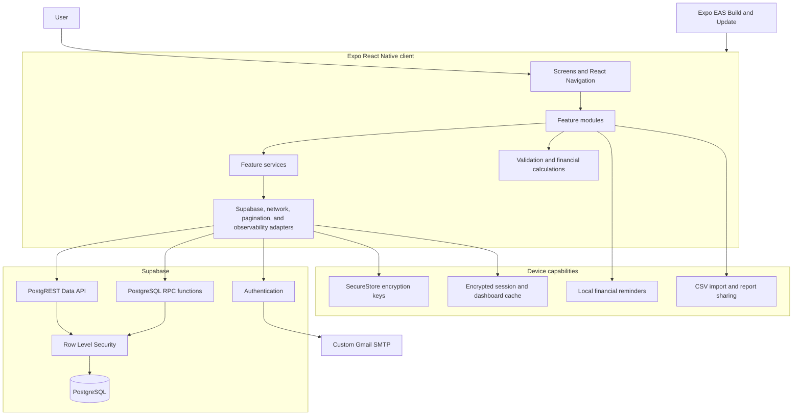
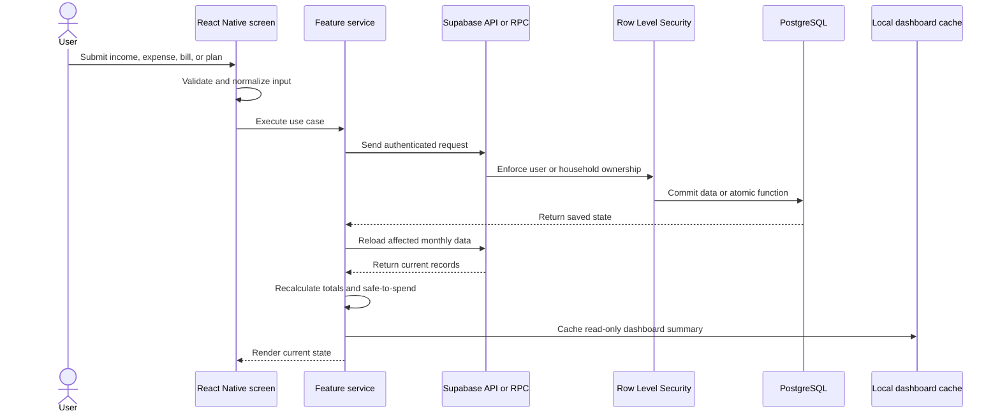
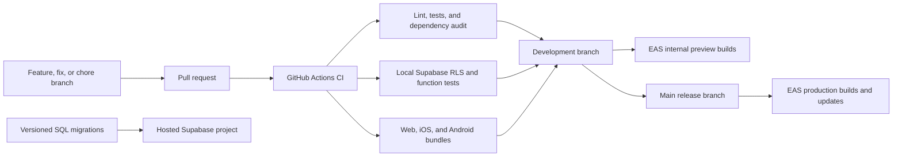

# Pocket-Mate System Architecture

Updated: 2026-09-02

Pocket-Mate is a feature-oriented Expo application backed by Supabase. The
mobile client is a modular monolith: presentation, feature services, pure
financial calculations, and infrastructure adapters are separated without
adding network boundaries that the current product does not need.

## Runtime Architecture

## Financial Write Flow

## Delivery Architecture

## Security Boundaries

- The client contains only the public Supabase URL and anonymous key.
- Supabase Row Level Security is the authorization boundary for every user and
  household record.
- Multi-record operations such as imports and bill payment plans use database
  functions when they require atomic behavior.
- Native authentication sessions are encrypted before AsyncStorage persistence;
  encryption keys remain in SecureStore.
- Provider secrets, SMTP credentials, service-role keys, and future AI keys must
  remain in hosted server configuration and never enter an Expo bundle.

## Scaling Direction

Add server-side boundaries only when required. AI assistance should use a
Supabase Edge Function or separately deployed API. Receipt storage should sit
behind a storage adapter. Redis is unnecessary for the current workload; add a
cache only after measurement shows repeated expensive server queries that
PostgreSQL indexes, pagination, or materialized summaries cannot address.

## Development Availability

The Free Plan can pause the hosted project after sustained low database
activity. `.github/workflows/supabase-activity.yml` performs a read-only,
RLS-protected database request three times daily. It requires repository secrets
named `SUPABASE_URL` and `SUPABASE_ANON_KEY`; neither value is stored in Git.
