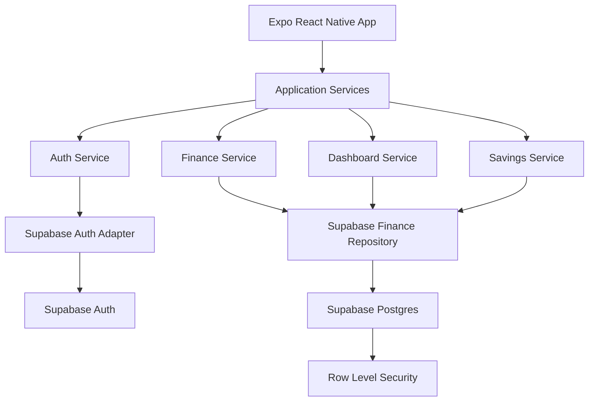
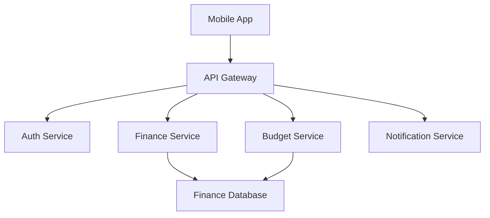

# Pocket-Mate System Design

## Current Architecture

Pocket-Mate starts as an Expo React Native mobile app using JavaScript and Supabase.



## Architecture Principle

The UI should not talk directly to Supabase tables. Screens should call feature services, and feature services should call API or repository boundaries.

This keeps the app adaptable if the backend, database, or hosting platform changes later.

## Monorepo Boundaries

```text
apps/
  mobile/
    Expo React Native app

supabase/
  migrations/
    database schema, indexes, and RLS policies
  functions/
    future backend endpoints and server-only logic

packages/
  shared/
    shared constants, validation, and finance calculations
```

## Backend-First Flow

Pocket-Mate should define backend contracts before building final UI screens.

Recommended flow:

1. Create or update Supabase migration.
2. Add Row Level Security policy.
3. Add backend endpoint or repository contract.
4. Add shared validation or calculation logic.
5. Build the mobile UI against that contract.

Early app screens may use placeholder data, but feature-complete screens should call the same service boundary that production data will use.

## Future Microservice Path

The first version should not deploy many services. It should be structured so services can be split later.



## Data Ownership

Each user-owned table should include:

- `id`
- `user_id`
- `created_at`
- `updated_at`

Each user must only access their own rows through Supabase Row Level Security.

## Core Tables

```text
profiles
income_entries
expense_categories
expenses
budget_caps
savings_goals
```

Detailed table planning is maintained in [database-schema.md](./database-schema.md).

## Security Rules

- Use Supabase Auth for identity.
- Enable Row Level Security on every user-owned table.
- Keep the Supabase service role key out of the app.
- Store only the public anon key in the app.
- Validate user input before saving.
- Keep finance calculations deterministic and testable.
- Avoid bank account syncing in the first version.

## Replaceability Goals

The app should make these changes possible later:

- Supabase Storage to Vercel Blob.
- Supabase direct queries to a custom backend API.
- Supabase Postgres to another Postgres host.
- Manual expenses to optional bank syncing.
- Mobile-only app to mobile plus web.
