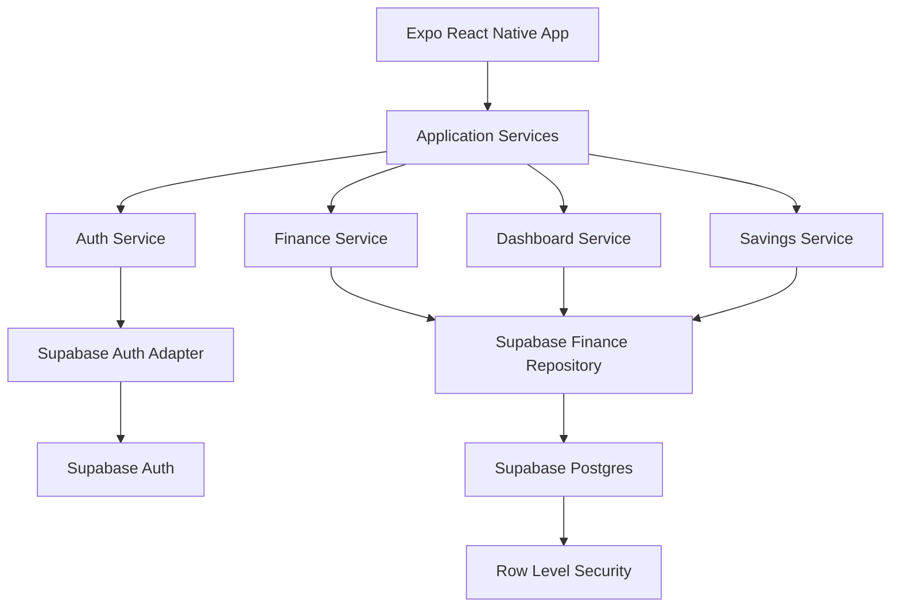
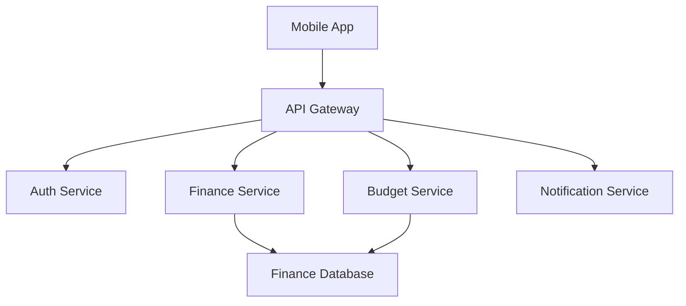

# Pocket-Mate System Design

## Current Architecture

Pocket-Mate starts as an Expo React Native mobile app using JavaScript and Supabase.


```mermaid
flowchart TD
    A["Expo React Native App"] --> B["Application Services"]
    B --> C["Auth Service"]
    B --> D["Finance Service"]
    B --> E["Dashboard Service"]
    B --> F["Savings Service"]

    C --> G["Supabase Auth Adapter"]
    D --> H["Supabase Finance Repository"]
    E --> H
    F --> H

    G --> I["Supabase Auth"]
    H --> J["Supabase Postgres"]
    J --> K["Row Level Security"]
```

## Architecture Principle

The UI should not talk directly to Supabase tables. Screens should call feature services, and feature services should call API or repository boundaries.

This keeps the app adaptable if the backend, database, or hosting platform changes later.

## Monorepo Boundaries

```text
apps/
  mobile/
    Expo React Native app

supabase/
  migrations/
    database schema, indexes, and RLS policies
  functions/
    future backend endpoints and server-only logic

packages/
  shared/
    shared constants, validation, and finance calculations
```

## Backend-First Flow

Pocket-Mate should define backend contracts before building final UI screens.

Recommended flow:

1. Create or update Supabase migration.
2. Add Row Level Security policy.
3. Add backend endpoint or repository contract.
4. Add shared validation or calculation logic.
5. Build the mobile UI against that contract.

Early app screens may use placeholder data, but feature-complete screens should call the same service boundary that production data will use.

## Future Microservice Path

The first version should not deploy many services. It should be structured so services can be split later.


```mermaid
flowchart TD
    A["Mobile App"] --> B["API Gateway"]
    B --> C["Auth Service"]
    B --> D["Finance Service"]
    B --> E["Budget Service"]
    B --> F["Notification Service"]
    D --> G["Finance Database"]
    E --> G
```

## Data Ownership

Each user-owned table should include:

- `id`
- `user_id`
- `created_at`
- `updated_at`

Each user must only access their own rows through Supabase Row Level Security.

## Core Tables

```text
profiles
income_entries
recurring_income_schedules
recurring_income_occurrences
expense_categories
expenses
budget_caps
savings_goals
recurring_expenses
credit_cards
credit_card_bills
bill_payment_plans
bill_payment_installments
financial_accounts
account_transfers
account_balance_adjustments
expense_splits
expense_refunds
budget_templates
budget_periods
budget_allocations
tags
expense_tags
categorization_rules
review_items
user_preferences
transaction_import_batches
transaction_import_rows
debt_settings
```

Bill-plan writes use authenticated Postgres functions so statement updates,
future-schedule replacement, and completed-payment preservation happen in one
transaction. Dashboard reads count completed statement installments as spending
only for cards using statement tracking. Purchase-tracked card payments are
transfers, which update cash and liability balances without becoming spending
twice.

Income and expenses may be assigned to accounts. Balances combine opening
balances, assigned cash flow, transfers, and signed reconciliation adjustments.
Adjustments preserve ledger history and remain independently reversible. The
dashboard keeps calendar-month
balance, checking/cash available, and after-plan money separate. Savings
accounts remain liquid for net-worth reporting but are excluded from everyday
spendable cash. Safe-to-spend cannot exceed either the monthly plan or actual
checking/cash, and uses the configured payday as its daily horizon.

Savings contributions use protected Postgres functions to create or reverse
the goal-progress row and account transfer in one transaction. Direct mutation
of a linked transfer is blocked so account balances and goal progress cannot
drift apart.

Purchase-impact checks are client-side, deterministic projections over the
dashboard summary and category-cap service results. The calculator does not
write hypothetical purchases. Confirmation hands validated values to the normal
expense-entry flow, keeping Supabase writes behind the finance service boundary.

Transaction adjustments and monthly budgets use the same deterministic finance
utilities in Dashboard, Plan, Insights, Activity, and reports. Protected
functions serialize split, refund, and expense-edit operations against the
parent expense. Month budgets are snapshots generated from future templates;
rollover values are recomputed from ordered period history so prior-month edits
cannot leave later months stale.

Categorization remains explainable and user-controlled. Rules use allowlisted
fields and operators with stable priority ordering. They never execute arbitrary
code, and uncertain rules create owned review items rather than silently
changing financial history.

The planning calendar is a read model built by a deterministic utility from
recorded and projected income, recurring expenses, card statements, payment installments, and the
profile pay-cycle anchor. When installments cover a source bill, cash-flow
totals count the installments and retain the source only as calendar context.
An Expo notification adapter schedules reminders locally and cancels only
identifiers owned by Pocket-Mate. No push provider or device token is required.

CSV import uses Papa Parse and a deterministic normalization engine before any
write. Users review default and row-level account/category assignments before
accepted rows enter an owned staging batch; protected Postgres functions
post or roll back ledger entries transactionally and recheck fingerprints at
commit time. Cash-flow trends reuse the reconciled Activity ledger. Debt payoff
scenarios use saved APR/minimum-payment settings and a deterministic cent-based
avalanche or snowball simulation.

Household collaboration keeps finance ownership unchanged. Membership,
invitation, role, and audit tables use RLS, while protected functions authorize
administrative actions and return aggregate monthly totals. The aggregate read
model exposes member identity and totals only; it never broadens direct access
to income, expense, card, transaction, or account rows. Invitation codes are
random, expiring, single-use, and stored as hashes.

Account deletion also uses a protected Postgres function. It derives identity
from the authenticated JWT, deletes finance rows in dependency order and the
Auth user in one transaction, then the auth service clears the local mobile
session. No service-role credential or target user ID is exposed to the client.

Detailed table planning is maintained in [database-schema.md](./database-schema.md).

## Security Rules

- Use Supabase Auth for identity.
- Enable Row Level Security on every user-owned table.
- Keep the Supabase service role key out of the app.
- Store only the public anon key in the app.
- Validate user input before saving.
- Keep finance calculations deterministic and testable.
- Avoid bank account syncing in the first version.
- Require explicit confirmation before irreversible account deletion.
- Keep household access changes behind role-checked database functions.
- Share household aggregates without weakening owner-only finance-table RLS.

## Replaceability Goals

The app should make these changes possible later:

- Supabase Storage to Vercel Blob.
- Supabase direct queries to a custom backend API.
- Supabase Postgres to another Postgres host.
- Manual expenses to optional bank syncing.
- Mobile-only app to mobile plus web.
