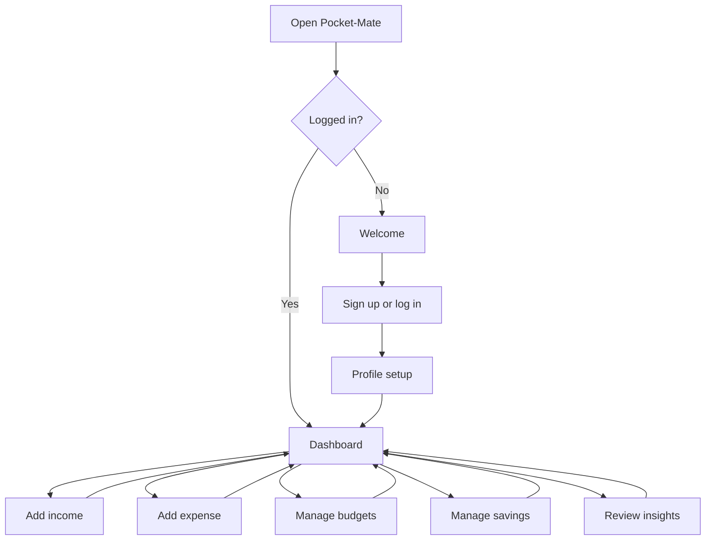
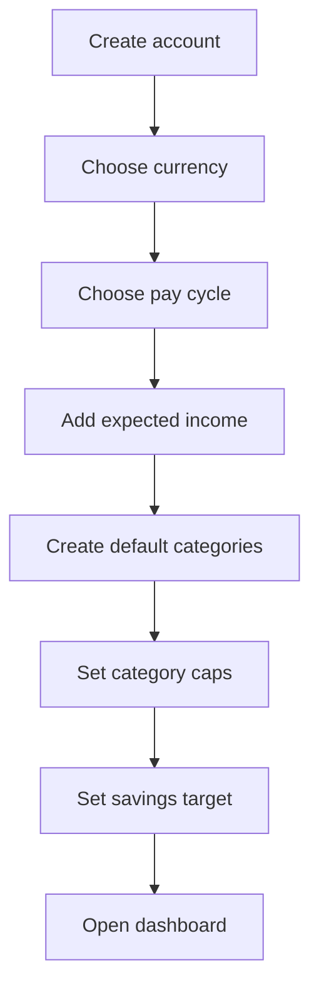
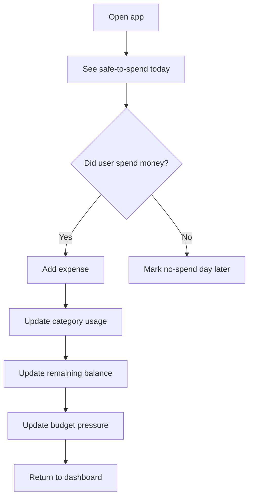
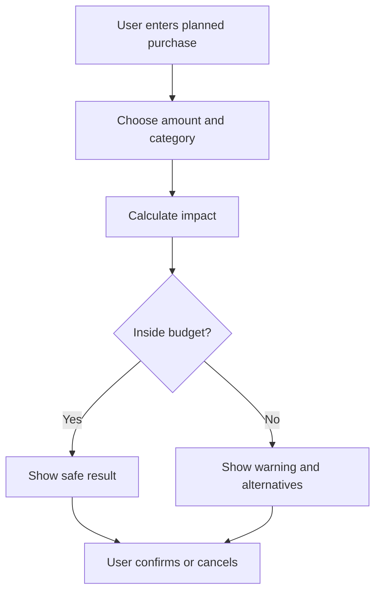

# Pocket-Mate User Flow

## Primary Flow



## First-Time Setup



## Daily Use Flow



## Planned Purchase Flow



## Main Navigation

```text
Dashboard
Expenses
Budgets
Savings
Settings
```

## Dashboard Requirements

The dashboard should make these visible without digging:

- Safe-to-spend today.
- Income this cycle.
- Spent this cycle.
- Savings protected.
- Remaining balance.
- Days until next payday.
- Category warnings.
- Recent expenses.
