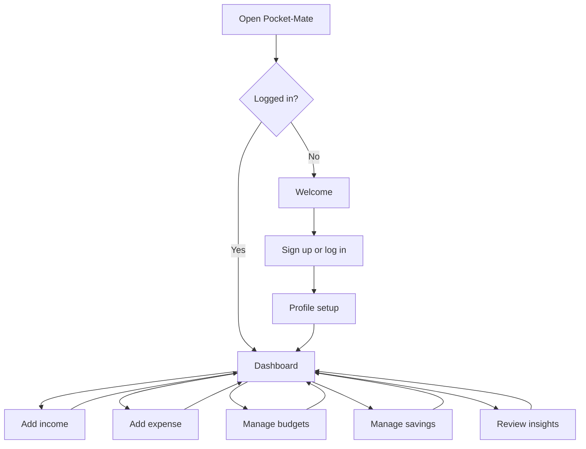
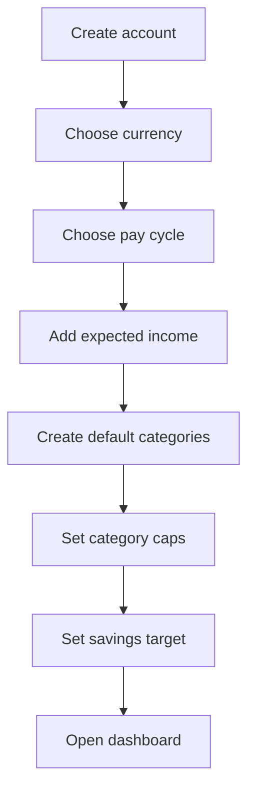
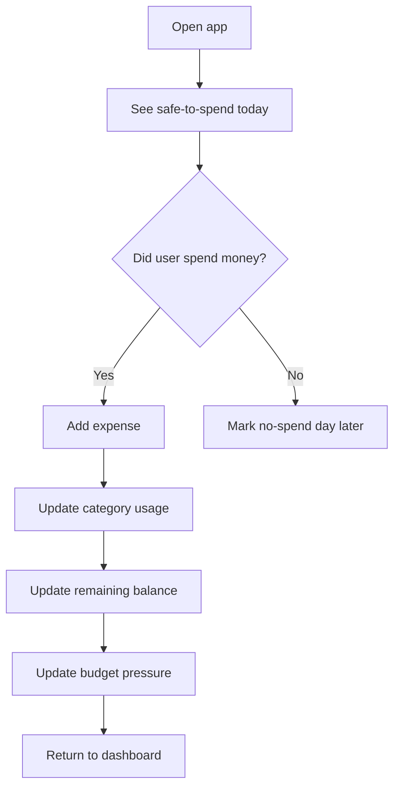
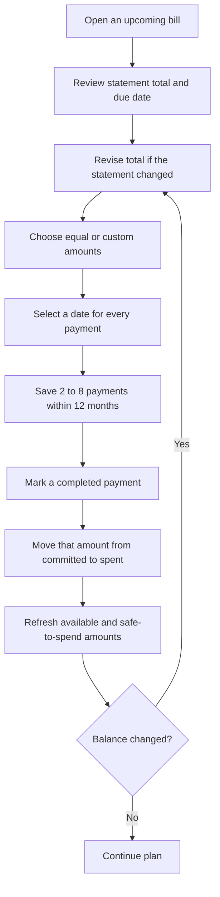
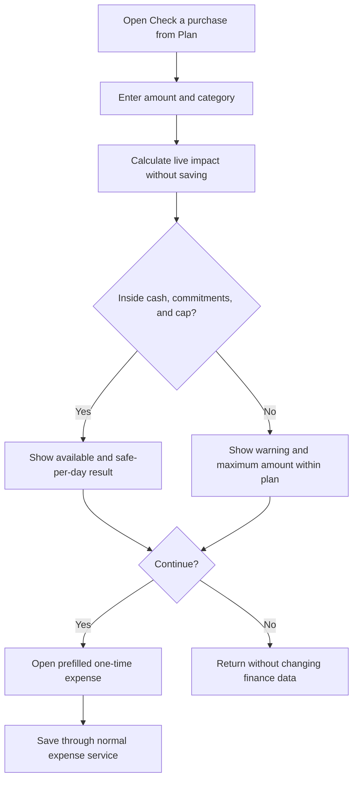

# Pocket-Mate User Flow

## Primary Flow


```mermaid
flowchart TD
    A["Open Pocket-Mate"] --> B{"Logged in?"}
    B -->|No| C["Welcome"]
    C --> D["Sign up or log in"]
    D --> E["Profile setup"]
    B -->|Yes| F["Dashboard"]
    E --> F

    F --> G["Add income"]
    F --> H["Add expense"]
    F --> I["Manage budgets"]
    F --> J["Manage savings"]
    F --> K["Review insights"]

    G --> F
    H --> F
    I --> F
    J --> F
    K --> F
```

## First-Time Setup


```mermaid
flowchart TD
    A["Create account"] --> B["Choose currency"]
    B --> C["Choose pay cycle"]
    C --> D["Add expected income"]
    D --> E["Create default categories"]
    E --> F["Set category caps"]
    F --> G["Set savings target"]
    G --> H["Open dashboard"]
```

## Daily Use Flow


```mermaid
flowchart TD
    A["Open app"] --> B["See safe-to-spend today"]
    B --> C{"Did user spend money?"}
    C -->|Yes| D["Add expense"]
    C -->|No| E["Mark no-spend day later"]
    D --> F["Update category usage"]
    F --> G["Update remaining balance"]
    G --> H["Update budget pressure"]
    H --> I["Return to dashboard"]
```

Saving a one-time, recurring, or card-bill expense must close the entry flow and
return to the dashboard. A successful save must never leave the user on a form
that appears frozen.

## Bill Payment Plan Flow


```mermaid
flowchart TD
    A["Open an upcoming bill"] --> B["Review statement total and due date"]
    B --> C["Revise total if the statement changed"]
    C --> D["Choose equal or custom amounts"]
    D --> E["Select a date for every payment"]
    E --> F["Save 2 to 8 payments within 12 months"]
    F --> G["Mark a completed payment"]
    G --> H["Move that amount from committed to spent"]
    H --> I["Refresh available and safe-to-spend amounts"]
    I --> J{"Balance changed?"}
    J -->|Yes| C
    J -->|No| K["Continue plan"]
```

Completed installments are immutable history while remaining installments can
be rescheduled. A card statement total cannot be reduced below the amount
already paid. Dates after the issuer due date are allowed for planning but must
show an interest-and-fee warning.

## Planned Purchase Flow


```mermaid
flowchart TD
    A["Open Check a purchase from Plan"] --> B["Enter amount and category"]
    B --> C["Calculate live impact without saving"]
    C --> D{"Inside cash, commitments, and cap?"}
    D -->|Yes| E["Show available and safe-per-day result"]
    D -->|No| F["Show warning and maximum amount within plan"]
    E --> G{"Continue?"}
    F --> G
    G -->|Yes| H["Open prefilled one-time expense"]
    G -->|No| I["Return without changing finance data"]
    H --> J["Save through normal expense service"]
```

Purchase checks are hypothetical. They must not create database rows until the
user confirms and saves the prefilled expense. Results use the current calendar
month and update from the same dashboard summary and budget-cap services as the
Plan screen.

## Main Navigation

```text
Dashboard
Expenses
Budgets
Savings
Settings
```

## Dashboard Requirements

The dashboard should make these visible without digging:

- Safe-to-spend today.
- Income this cycle.
- Spent this cycle.
- Savings protected.
- Remaining balance.
- Days until next payday.
- Category warnings.
- Recent expenses.
- Paid bill installments included in spent and available totals.
- Remaining bill installments included in committed totals.
