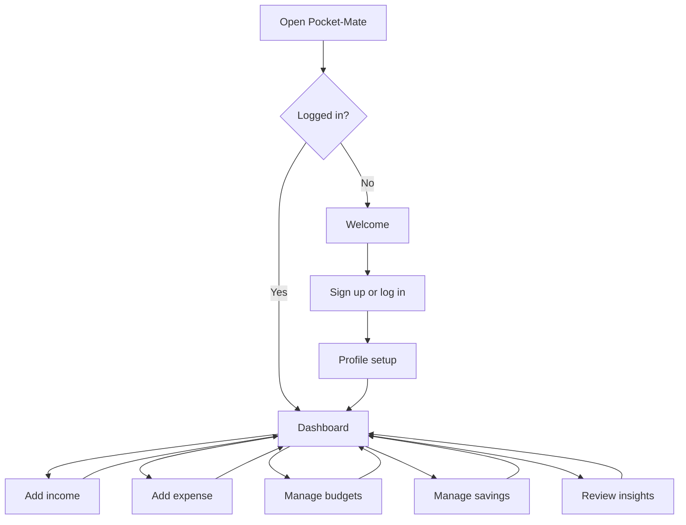
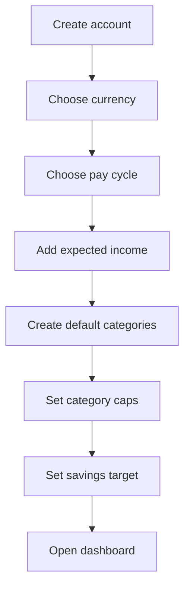
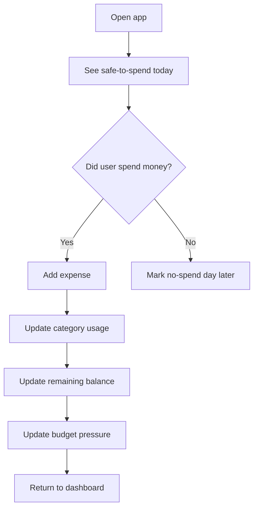
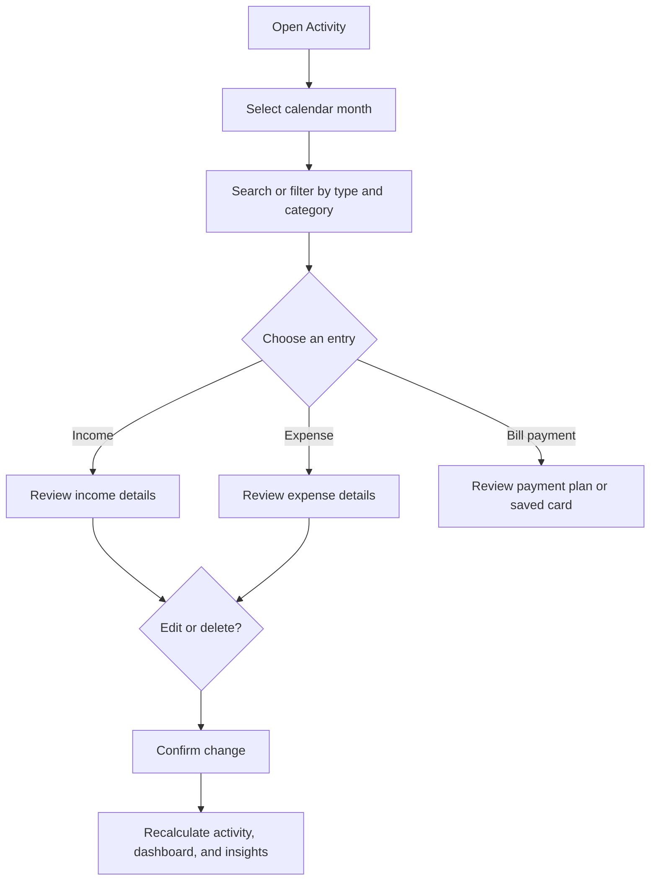
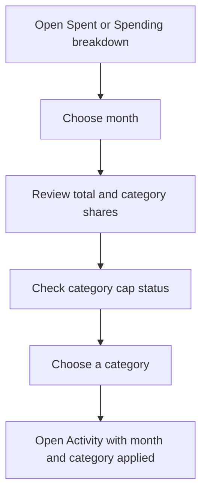
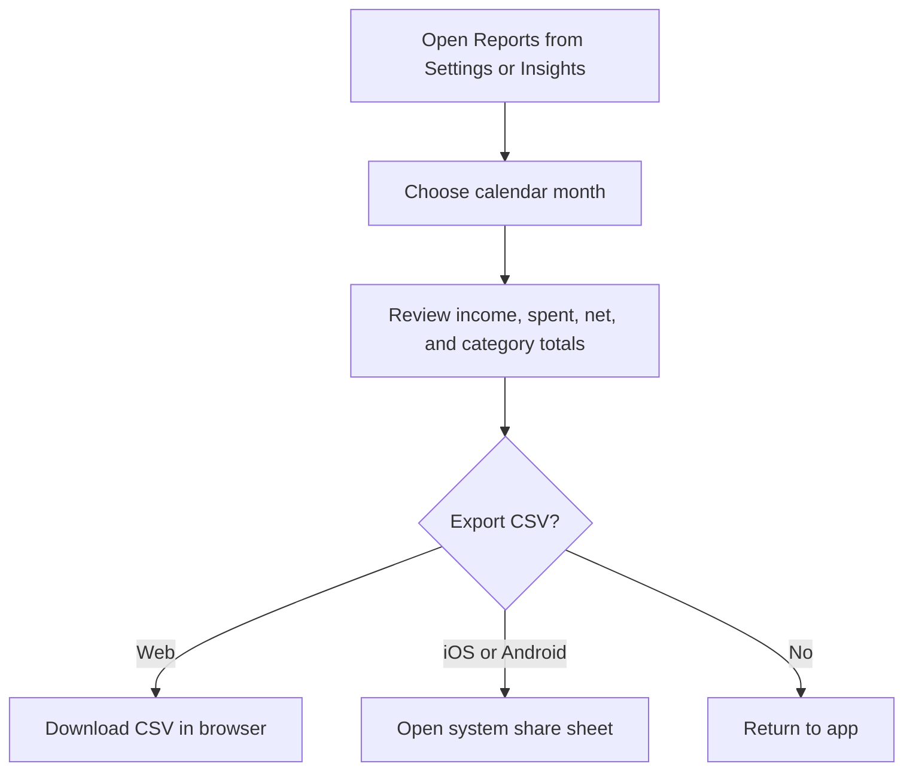
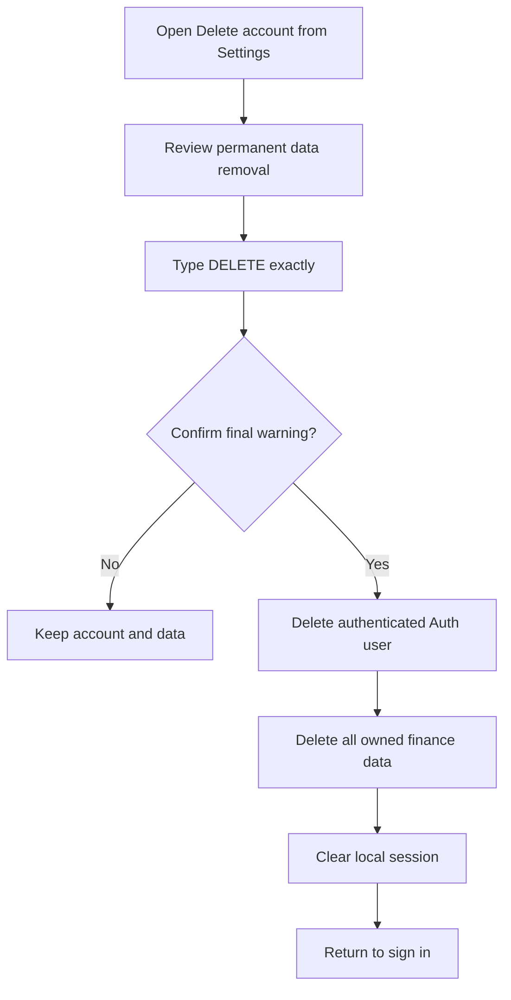
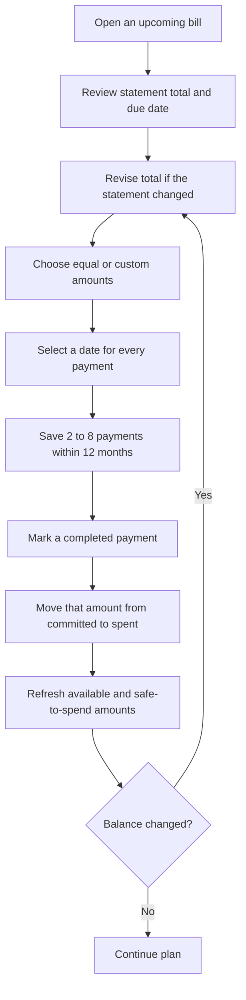
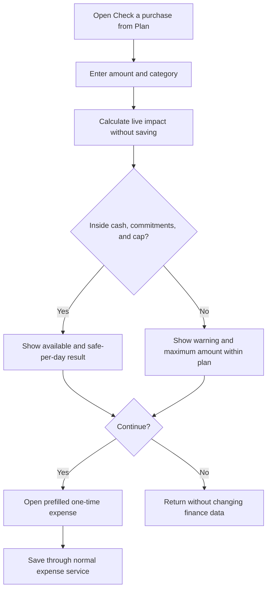

# Pocket-Mate User Flow

## Primary Flow


```mermaid
flowchart TD
    A["Open Pocket-Mate"] --> B{"Logged in?"}
    B -->|No| C["Welcome"]
    C --> D["Sign up or log in"]
    D --> E["Profile setup"]
    B -->|Yes| F["Dashboard"]
    E --> F

    F --> G["Add income"]
    F --> H["Add expense"]
    F --> I["Manage budgets"]
    F --> J["Manage savings"]
    F --> K["Review insights"]

    G --> F
    H --> F
    I --> F
    J --> F
    K --> F
```

## First-Time Setup


```mermaid
flowchart TD
    A["Create account"] --> B["Choose currency"]
    B --> C["Choose pay cycle"]
    C --> D["Add expected income"]
    D --> E["Create default categories"]
    E --> F["Set category caps"]
    F --> G["Set savings target"]
    G --> H["Open dashboard"]
```

## Daily Use Flow


```mermaid
flowchart TD
    A["Open app"] --> B["See safe-to-spend today"]
    B --> C{"Did user spend money?"}
    C -->|Yes| D["Add expense"]
    C -->|No| E["Mark no-spend day later"]
    D --> F["Update category usage"]
    F --> G["Update remaining balance"]
    G --> H["Update budget pressure"]
    H --> I["Return to dashboard"]
```

Saving a one-time, recurring, or card-bill expense must close the entry flow and
return to the dashboard. A successful save must never leave the user on a form
that appears frozen.

## Activity And Correction Flow


```mermaid
flowchart TD
    A["Open Activity"] --> B["Select calendar month"]
    B --> C["Search or filter by type and category"]
    C --> D{"Choose an entry"}
    D -->|Income| E["Review income details"]
    D -->|Expense| F["Review expense details"]
    D -->|Bill payment| G["Review payment plan or saved card"]
    E --> H{"Edit or delete?"}
    F --> H
    H --> I["Confirm change"]
    I --> J["Recalculate activity, dashboard, and insights"]
```

Activity is a cash-movement ledger. It includes income, one-time expenses,
completed bill-plan installments, and directly paid card statements. Unpaid
statements remain in Upcoming bills and are not counted as spending until paid.

From an expense detail, the user can split the original total across unique
categories, attach tags, or record one or more refunds. Refunds reduce spending
instead of inflating income, and a destination account receives the returned
cash. Editing an expense amount clears a stale split and cannot reduce the total
below refunds already received.

## Monthly Budget And Rollover Flow

1. Open **Plan > Monthly budget** and choose a calendar month.
2. Set a category amount and choose no rollover, surplus-only rollover, or full
   signed rollover.
3. Choose whether the amount becomes the default for future months.
4. Review spent, available, remaining, and carried-in amounts per category.
5. Navigate to an earlier month to make a correction; every later rollover is
   recalculated deterministically.

## Rules, Tags, And Review Flow

1. Open **Settings > Rules, tags, and review**.
2. Create tags for contexts such as reimbursable, work, or travel.
3. Create merchant or note rules with an explicit category and review action.
4. A matching new expense is categorized consistently.
5. Rules configured for review appear in a queue where the user approves or
   ignores the item.

## Planning Calendar And Reminder Flow

1. Open **Plan > Planning calendar** to review income, recurring charges, card
   statements, payment chunks, and expected paydays by date.
2. Move between calendar months without changing finance data.
3. Select an income entry to review it, or select a bill or payment chunk to
   open its payment plan.
4. Open **Settings > Reminders and display** to enable local reminders, choose
   event types, lead days, and a reminder hour.
5. Pocket-Mate replaces only its own scheduled notifications on that device
   when settings or source bills change.

The calendar keeps the original obligation visible when a payment plan exists,
but expected monthly outflow counts the scheduled chunks instead of counting
both the full bill and its chunks. Reminders use on-device scheduling and do not
register a remote push token.

Display preferences can mask dashboard amounts, show fewer dashboard rows, and
increase secondary-text contrast. They never change stored finance values.

## Monthly Insights Flow


```mermaid
flowchart TD
    A["Open Spent or Spending breakdown"] --> B["Choose month"]
    B --> C["Review total and category shares"]
    C --> D["Check category cap status"]
    D --> E["Choose a category"]
    E --> F["Open Activity with month and category applied"]
```

## Monthly Report And Export Flow


```mermaid
flowchart TD
    A["Open Reports from Settings or Insights"] --> B["Choose calendar month"]
    B --> C["Review income, spent, net, and category totals"]
    C --> D{"Export CSV?"}
    D -->|Web| E["Download CSV in browser"]
    D -->|iOS or Android| F["Open system share sheet"]
    D -->|No| G["Return to app"]
```

The report uses the same cash-movement ledger as Activity and Insights. CSV
files include income, expenses, and completed bill payments, use signed decimal
amounts, and are created locally without uploading another copy.

## Import And Financial Trends Flow

1. Open **Settings > Import transactions** and choose a CSV file.
2. Pocket-Mate normalizes common bank headers, validates every row, and marks
   duplicates from the file or earlier posted imports.
3. Choose the expense category, review accepted and rejected rows, then post the
   accepted rows as one transactional batch.
4. Use Import history to undo a posted batch and remove only entries created by
   that batch.
5. Open **Settings > Cash-flow trends** to compare six months of reconciled
   income, spending after refunds, monthly net, and savings rate.

## Debt Payoff Flow

1. Add loan or credit-card balances under Accounts.
2. Open **Plan > Debt payoff** and enter APR and minimum payment for each debt.
3. Choose avalanche (highest APR first) or snowball (smallest balance first),
   then set an extra monthly payment.
4. Review the debt-free date, total projected interest, payment budget, and any
   non-amortizing warning. The scenario never creates payments automatically.

## Account Deletion Flow


```mermaid
flowchart TD
    A["Open Delete account from Settings"] --> B["Review permanent data removal"]
    B --> C["Type DELETE exactly"]
    C --> D{"Confirm final warning?"}
    D -->|No| E["Keep account and data"]
    D -->|Yes| F["Delete authenticated Auth user"]
    F --> G["Delete all owned finance data"]
    G --> H["Clear local session"]
    H --> I["Return to sign in"]
```

The deletion request never contains a target user ID. The database derives the
account from the active authenticated session, and the complete deletion occurs
in one transaction.

## Bill Payment Plan Flow


```mermaid
flowchart TD
    A["Open an upcoming bill"] --> B["Review statement total and due date"]
    B --> C["Revise total if the statement changed"]
    C --> D["Choose equal or custom amounts"]
    D --> E["Select a date for every payment"]
    E --> F["Save 2 to 8 payments within 12 months"]
    F --> G["Mark a completed payment"]
    G --> H["Move that amount from committed to spent"]
    H --> I["Refresh available and safe-to-spend amounts"]
    I --> J{"Balance changed?"}
    J -->|Yes| C
    J -->|No| K["Continue plan"]
```

Completed installments are immutable history while remaining installments can
be rescheduled. A card statement total cannot be reduced below the amount
already paid. Dates after the issuer due date are allowed for planning but must
show an interest-and-fee warning.

## Planned Purchase Flow


```mermaid
flowchart TD
    A["Open Check a purchase from Plan"] --> B["Enter amount and category"]
    B --> C["Calculate live impact without saving"]
    C --> D{"Inside cash, commitments, and cap?"}
    D -->|Yes| E["Show available and safe-per-day result"]
    D -->|No| F["Show warning and maximum amount within plan"]
    E --> G{"Continue?"}
    F --> G
    G -->|Yes| H["Open prefilled one-time expense"]
    G -->|No| I["Return without changing finance data"]
    H --> J["Save through normal expense service"]
```

Purchase checks are hypothetical. They must not create database rows until the
user confirms and saves the prefilled expense. Results use the current calendar
month and update from the same dashboard summary and budget-cap services as the
Plan screen.

## Accounts And Transfers

1. The user opens **Settings > Accounts and transfers**.
2. They add checking, savings, cash, investment, loan, or other accounts with a
   current opening balance. Credit-card accounts are created from saved cards.
3. New income can be assigned to a deposit account and expenses can be assigned
   to the account used for payment.
4. Moving money between accounts creates a transfer. Transfers affect balances
   but never income, spending, net cash flow, or category budgets.
5. Before marking a card statement or installment paid, the user chooses the
   account funding it. The payment reduces available cash and card debt.
6. Each card explicitly uses statement or purchase tracking. Statement tracking
   remains the backward-compatible default.

## Main Navigation

```text
Home
Activity
Plan
Settings
```

## Dashboard Requirements

The dashboard should make these visible without digging:

- Safe-to-spend today.
- Income this calendar month.
- Spent this calendar month.
- Savings protected.
- Remaining balance.
- Days until next payday.
- Category warnings.
- Top category spending with access to the full monthly breakdown.
- Recent expenses.
- Paid bill installments included in spent and available totals.
- Remaining bill installments included in committed totals.
